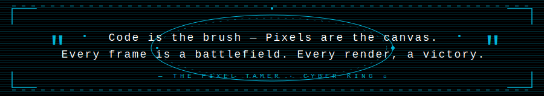

<div align="center">

<!-- ════════════════════════════════════════════════════ -->
<!--          ANIMATED HERO — glitch + particles        -->
<!-- ════════════════════════════════════════════════════ -->



<br>

<!-- Live badges -->


<br>

[](https://extensions.blender.org/approval-queue/pixelsync-porter/)
[](https://discord.com/users/1323643345087762442)
[](https://github.com/CyberVisionStudio)

</div>

---

<!-- ════════════════════════════════════════════════════ -->
<!--           SYSTEM MANIFEST TERMINAL                  -->
<!-- ════════════════════════════════════════════════════ -->

---

<div align="center">



</div>

---

---

<!-- ════════════════════════════════════════════════════ -->
<!--     ANIMATED SKILLS — rotating rings + bars        -->
<!-- ════════════════════════════════════════════════════ -->



---

<!-- ════════════════════════════════════════════════════ -->
<!--         ENGINEERING MATRIX BANNER                   -->
<!-- ════════════════════════════════════════════════════ -->



<div align="center">


</div>

---

<!-- ════════════════════════════════════════════════════ -->
<!--              GITHUB STATS                           -->
<!-- ════════════════════════════════════════════════════ -->

<div align="center">

## 📊 Neural Interface Statistics


<br>


<br>


<br>


</div>

---

<!-- ════════════════════════════════════════════════════ -->
<!--           FEATURED PROJECT — PIXELSYNC             -->
<!-- ════════════════════════════════════════════════════ -->

<div align="center">

## ◈ Featured Mission — PixelSync Porter

</div>

```python
# PixelSync Porter v2.4.0
# ─────────────────────────────────────────────────────────
# Blender Extension — seamless cross-pipeline asset migration
# ─────────────────────────────────────────────────────────

class PixelSyncPorter:
    name     = "PixelSync Porter"
    version  = "2.4.0"
    status   = "ACTIVE"
    platform = "Blender Extensions"
    author   = "THE PIXEL TAMER"

    features = [
        "Auto-syncs texture and material libraries",
        "Cross-version Blender compatibility",
        "One-click pipeline integration",
        "Zero-loss asset porting between projects",
    ]
```

<div align="center">

[](https://extensions.blender.org/approval-queue/pixelsync-porter/)

</div>

---

<!-- ════════════════════════════════════════════════════ -->
<!--          ANIMATED QUOTE with orbiting rings        -->
<!-- ════════════════════════════════════════════════════ -->



---
<div align="center">
  
</div>
